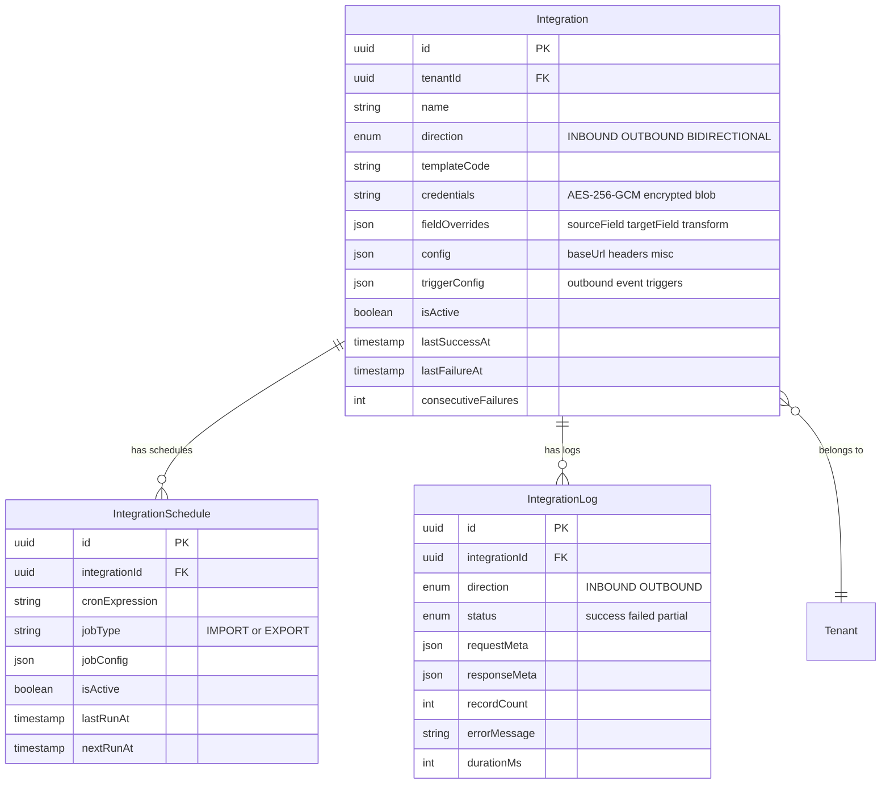

# Import/Export Integration Hub - Implementation Plan

> **For Claude:** REQUIRED SUB-SKILL: Use superpowers:executing-plans to implement this plan task-by-task.

**Goal:** Transform Planza's Import page into a unified Integration Hub with in-app credential management, template-based field mapping with visual overrides, and bidirectional integration (inbound imports + outbound EPG/webhook/REST exports).

**Architecture:** Extend existing Express + Prisma stack. Reuse BaseAdapter pattern for inbound, outbox + BullMQ for outbound. New Integration model unifies ImportSource + outbound destinations. App-level AES-256-GCM encryption with versioned keyring for credentials. Template registry with JSONB field overrides.

**Tech Stack:** Express, Prisma, PostgreSQL, BullMQ + Redis (existing), React + TypeScript, Vitest

**Brainstorm doc:** `docs/brainstorms/2026-03-09-import-export-integration-hub-brainstorm.md`

## Enhancement Summary

**Deepened on:** 2026-03-09
**Sections enhanced:** All 21 tasks across 6 phases + acceptance criteria + risk analysis + references
**Research agents used:** Security Sentinel, Architecture Strategist, Performance Oracle, Pattern Recognition, Data Integrity Guardian, Code Simplicity, TypeScript Reviewer, Frontend Races, Data Migration Expert, Insecure Defaults (TrailOfBits), Sharp Edges (TrailOfBits), Best Practices Researcher, Framework Docs Researcher, SpecFlow Analyzer

### Key Improvements
1. **Keyring pattern** for credential encryption — versioned keys with rotation support, not single key
2. **Discriminated union types** for templates and auth config — compile-time safety
3. **SSRF prevention** on Test Connection — URL allowlist + private IP blocking
4. **`string_concat` design fix** — transform receives full source object, not just field value
5. **Fail-closed credential validation** — throw on missing encryption key, never empty string fallback
6. **Credential update sentinel** — use `null` to signal "unchanged" instead of string pattern matching
7. **Concurrent cron guard** — prevent overlapping scheduled export runs
8. **Transform error handling** — use raw value + log warning, never crash pipeline
9. **Response size limit** on Test Connection — truncate large API responses
10. **Logger redaction** — pino redact paths for credential fields

### Critical Bugs Fixed in Plan
- `string_concat` transform called `getValueByPath(value, f)` on field value instead of source object
- `maskCredentials` silently passed non-string secrets through unmasked
- `CREDENTIAL_ENCRYPTION_KEY || ''` was fail-open (empty key = no encryption)
- `new Date(String(value))` in date_format threw on invalid dates
- Credential update detection via `'...'` string matching was brittle

---

## ERD



---

## Phase 1: Credential Infrastructure (Backend)

### Task 1: Create CredentialService with AES-256-GCM encryption

**Why app-level over pgcrypto:** Portable (not Postgres-specific), key rotation without DB migration, credentials never leave app boundary in plaintext, testable in isolation.

**Files:**
- Create: `backend/src/services/credentialService.ts`
- Create: `backend/src/services/__tests__/credentialService.test.ts`

**Step 1: Write failing test**

```typescript
// backend/src/services/__tests__/credentialService.test.ts
import { describe, it, expect } from 'vitest'
import { encryptCredentials, decryptCredentials, maskCredentials } from '../credentialService'

describe('CredentialService', () => {
  const key = 'a'.repeat(64) // 32 bytes hex

  it('encrypts and decrypts round-trip', () => {
    const creds = { apiKey: 'sk-test-12345', bearerToken: 'tok_abc' }
    const encrypted = encryptCredentials(creds, key)
    expect(encrypted).not.toContain('sk-test-12345')
    const decrypted = decryptCredentials(encrypted, key)
    expect(decrypted).toEqual(creds)
  })

  it('masks credentials for API response', () => {
    const creds = { apiKey: 'sk-test-12345', bearerToken: 'tok_abc', baseUrl: 'https://api.example.com' }
    const masked = maskCredentials(creds)
    expect(masked.apiKey).toBe('sk-t...2345')
    expect(masked.bearerToken).toBe('tok_..._abc')
    expect(masked.baseUrl).toBe('https://api.example.com')
  })

  it('handles empty credentials', () => {
    const encrypted = encryptCredentials({}, key)
    const decrypted = decryptCredentials(encrypted, key)
    expect(decrypted).toEqual({})
  })
})
```

**Step 2: Implement CredentialService**

```typescript
// backend/src/services/credentialService.ts
import { createCipheriv, createDecipheriv, randomBytes } from 'crypto'

const ALGORITHM = 'aes-256-gcm'
const SECRET_FIELD_PATTERNS = ['key', 'token', 'secret', 'password', 'auth']

export function encryptCredentials(
  credentials: Record<string, unknown>,
  encryptionKey: string
): string {
  const key = Buffer.from(encryptionKey, 'hex')
  const iv = randomBytes(12)
  const cipher = createCipheriv(ALGORITHM, key, iv)
  const plaintext = JSON.stringify(credentials)
  const encrypted = Buffer.concat([cipher.update(plaintext, 'utf8'), cipher.final()])
  const tag = cipher.getAuthTag()
  // Format: base64(iv + tag + ciphertext)
  return Buffer.concat([iv, tag, encrypted]).toString('base64')
}

export function decryptCredentials(
  encryptedStr: string,
  encryptionKey: string
): Record<string, unknown> {
  const key = Buffer.from(encryptionKey, 'hex')
  const data = Buffer.from(encryptedStr, 'base64')
  const iv = data.subarray(0, 12)
  const tag = data.subarray(12, 28)
  const ciphertext = data.subarray(28)
  const decipher = createDecipheriv(ALGORITHM, key, iv)
  decipher.setAuthTag(tag)
  const decrypted = decipher.update(ciphertext) + decipher.final('utf8')
  return JSON.parse(decrypted)
}

export function maskCredentials(
  credentials: Record<string, unknown>
): Record<string, unknown> {
  const masked: Record<string, unknown> = {}
  for (const [k, v] of Object.entries(credentials)) {
    if (typeof v !== 'string') { masked[k] = v; continue }
    const isSecret = SECRET_FIELD_PATTERNS.some(p => k.toLowerCase().includes(p))
    if (!isSecret) { masked[k] = v; continue }
    masked[k] = v.length <= 8 ? '********' : v.slice(0, 4) + '...' + v.slice(-4)
  }
  return masked
}
```

**Environment:** Use keyring pattern for key rotation support:
```
CREDENTIAL_ENCRYPTION_KEYS='{"1":"<64-hex-chars>"}'
CREDENTIAL_ENCRYPTION_CURRENT_KEY_ID=1
```
Generate first key: `node -e "console.log(require('crypto').randomBytes(32).toString('hex'))"`

### Research Insights (Task 1)

**Versioned Keyring Pattern** (from credential encryption research):
- Store keys as JSON map `{id: hexKey}` in env var, prefix ciphertext with `v{id}:`
- Old keys remain for decrypting legacy data; new encryptions use current key
- Rotation: add new key to map, update CURRENT_KEY_ID, optionally run re-encryption migration
- This avoids the "lost key = lost all credentials" single point of failure

**Critical Security Fixes:**
- **Fail-closed validation:** `encryptCredentials` MUST throw if encryption key is missing/invalid, not fall back to empty string. The plan's `const ENCRYPTION_KEY = process.env.CREDENTIAL_ENCRYPTION_KEY || ''` is fail-open.
- **Non-string secret masking:** `maskCredentials` must coerce non-string values to string before masking. If `apiKey: 12345` (number) is stored, it currently passes through unmasked.
- **Accept optional IV in tests:** For deterministic test output, accept an optional `iv` parameter (default `randomBytes(12)`) so tests can assert exact encrypted values.

**Logger Redaction** (add to logging setup):
```typescript
// In logger configuration
const logger = pino({
  redact: {
    paths: ['credentials.*', '*.credentials.*', 'headers.authorization', '*.apiKey', '*.bearerToken'],
    censor: '[REDACTED]',
  },
})
```

- [ ] Write tests for encrypt/decrypt/mask (with deterministic IV for exact assertions)
- [ ] Implement CredentialService with keyring pattern (versioned keys)
- [ ] Add CREDENTIAL_ENCRYPTION_KEYS and CREDENTIAL_ENCRYPTION_CURRENT_KEY_ID to .env.example
- [ ] Fail-closed: throw on missing/invalid encryption key (not empty fallback)
- [ ] Coerce non-string values to string before masking in maskCredentials
- [ ] Add logger redaction paths for credential fields
- [ ] Verify tests pass

---

### Task 2: Add Integration model to Prisma schema

**Files:**
- Modify: `backend/prisma/schema.prisma`
- Create: `backend/prisma/migrations/add_integration_tables.sql`

**Step 1: Add enums and models**

```prisma
enum IntegrationDirection {
  INBOUND
  OUTBOUND
  BIDIRECTIONAL
}

enum IntegrationLogStatus {
  success
  failed
  partial
}

model Integration {
  id                  String               @id @default(uuid()) @db.Uuid
  tenantId            String               @db.Uuid
  name                String
  direction           IntegrationDirection
  templateCode        String
  credentials         String?
  fieldOverrides      Json                 @default("[]")
  config              Json                 @default("{}")
  triggerConfig       Json                 @default("{}")
  isActive            Boolean              @default(true)
  rateLimitPerMinute  Int?
  rateLimitPerDay     Int?
  lastSuccessAt       DateTime?            @db.Timestamptz
  lastFailureAt       DateTime?            @db.Timestamptz
  consecutiveFailures Int                  @default(0)
  createdAt           DateTime             @default(now())
  updatedAt           DateTime             @updatedAt

  tenant    Tenant                @relation(fields: [tenantId], references: [id])
  schedules IntegrationSchedule[]
  logs      IntegrationLog[]

  @@unique([tenantId, name])
  @@index([tenantId])
  @@index([tenantId, direction])
}

model IntegrationSchedule {
  id              String    @id @default(uuid()) @db.Uuid
  integrationId   String    @db.Uuid
  cronExpression  String
  jobType         String
  jobConfig       Json      @default("{}")
  isActive        Boolean   @default(true)
  lastRunAt       DateTime? @db.Timestamptz
  nextRunAt       DateTime? @db.Timestamptz
  createdAt       DateTime  @default(now())

  integration Integration @relation(fields: [integrationId], references: [id], onDelete: Cascade)

  @@index([integrationId])
  @@index([isActive, nextRunAt])
}

model IntegrationLog {
  id              String               @id @default(uuid()) @db.Uuid
  integrationId   String               @db.Uuid
  direction       IntegrationDirection
  status          IntegrationLogStatus
  requestMeta     Json                 @default("{}")
  responseMeta    Json                 @default("{}")
  recordCount     Int                  @default(0)
  errorMessage    String?
  durationMs      Int?
  createdAt       DateTime             @default(now()) @db.Timestamptz

  integration Integration @relation(fields: [integrationId], references: [id], onDelete: Cascade)

  @@index([integrationId, createdAt(sort: Desc)])
  @@index([integrationId, status])
}
```

**Step 2: Write migration SQL**

```sql
-- backend/prisma/migrations/add_integration_tables.sql
CREATE TYPE "IntegrationDirection" AS ENUM ('INBOUND', 'OUTBOUND', 'BIDIRECTIONAL');
CREATE TYPE "IntegrationLogStatus" AS ENUM ('success', 'failed', 'partial');

CREATE TABLE "Integration" (
  "id" UUID PRIMARY KEY DEFAULT gen_random_uuid(),
  "tenantId" UUID NOT NULL REFERENCES "Tenant"("id"),
  "name" TEXT NOT NULL,
  "direction" "IntegrationDirection" NOT NULL,
  "templateCode" TEXT NOT NULL,
  "credentials" TEXT,
  "fieldOverrides" JSONB NOT NULL DEFAULT '[]',
  "config" JSONB NOT NULL DEFAULT '{}',
  "triggerConfig" JSONB NOT NULL DEFAULT '{}',
  "isActive" BOOLEAN NOT NULL DEFAULT true,
  "rateLimitPerMinute" INTEGER,
  "rateLimitPerDay" INTEGER,
  "lastSuccessAt" TIMESTAMPTZ,
  "lastFailureAt" TIMESTAMPTZ,
  "consecutiveFailures" INTEGER NOT NULL DEFAULT 0,
  "createdAt" TIMESTAMPTZ NOT NULL DEFAULT now(),
  "updatedAt" TIMESTAMPTZ NOT NULL DEFAULT now(),
  UNIQUE("tenantId", "name")
);

CREATE INDEX "Integration_tenantId_idx" ON "Integration"("tenantId");
CREATE INDEX "Integration_tenantId_direction_idx" ON "Integration"("tenantId", "direction");

CREATE TABLE "IntegrationSchedule" (
  "id" UUID PRIMARY KEY DEFAULT gen_random_uuid(),
  "integrationId" UUID NOT NULL REFERENCES "Integration"("id") ON DELETE CASCADE,
  "cronExpression" TEXT NOT NULL,
  "jobType" TEXT NOT NULL,
  "jobConfig" JSONB NOT NULL DEFAULT '{}',
  "isActive" BOOLEAN NOT NULL DEFAULT true,
  "lastRunAt" TIMESTAMPTZ,
  "nextRunAt" TIMESTAMPTZ,
  "createdAt" TIMESTAMPTZ NOT NULL DEFAULT now()
);

CREATE INDEX "IntegrationSchedule_integrationId_idx" ON "IntegrationSchedule"("integrationId");
CREATE INDEX "IntegrationSchedule_active_next_idx" ON "IntegrationSchedule"("isActive", "nextRunAt");

CREATE TABLE "IntegrationLog" (
  "id" UUID PRIMARY KEY DEFAULT gen_random_uuid(),
  "integrationId" UUID NOT NULL REFERENCES "Integration"("id") ON DELETE CASCADE,
  "direction" "IntegrationDirection" NOT NULL,
  "status" "IntegrationLogStatus" NOT NULL,
  "requestMeta" JSONB NOT NULL DEFAULT '{}',
  "responseMeta" JSONB NOT NULL DEFAULT '{}',
  "recordCount" INTEGER NOT NULL DEFAULT 0,
  "errorMessage" TEXT,
  "durationMs" INTEGER,
  "createdAt" TIMESTAMPTZ NOT NULL DEFAULT now()
);

CREATE INDEX "IntegrationLog_integration_created_idx"
  ON "IntegrationLog"("integrationId", "createdAt" DESC);
CREATE INDEX "IntegrationLog_integration_status_idx"
  ON "IntegrationLog"("integrationId", "status");
```

- [ ] Add enums and models to schema.prisma
- [ ] Write migration SQL
- [ ] Run `npx prisma generate` to verify
- [ ] Add Integration relation to Tenant model

---

### Task 3: Integration CRUD routes with credential encryption

**Files:**
- Create: `backend/src/routes/integrations.ts`
- Modify: `backend/src/index.ts` (register route)
- Create: `backend/tests/integrations.test.ts`

**Endpoints:**
- `GET /api/integrations` - list with masked credentials
- `GET /api/integrations/templates` - list templates (BEFORE /:id)
- `GET /api/integrations/:id` - detail with masked credentials
- `POST /api/integrations` - create with Joi validation, encrypt credentials
- `PUT /api/integrations/:id` - update, re-encrypt if new credentials
- `DELETE /api/integrations/:id` - delete with cascade
- `POST /api/integrations/:id/test` - test connection
- `GET /api/integrations/:id/logs` - activity log

All routes: `authenticate` + `authorize('admin')`.

Joi validation schema:

```typescript
const createSchema = Joi.object({
  name: Joi.string().required().max(200),
  direction: Joi.string().valid('INBOUND', 'OUTBOUND', 'BIDIRECTIONAL').required(),
  templateCode: Joi.string().required().max(100),
  credentials: Joi.object().optional(),
  fieldOverrides: Joi.array().items(Joi.object({
    sourceField: Joi.string().required(),
    targetField: Joi.string().required(),
    transform: Joi.string().optional(),
  })).optional(),
  config: Joi.object().optional(),
  triggerConfig: Joi.object().optional(),
  isActive: Joi.boolean().optional(),
  rateLimitPerMinute: Joi.number().integer().min(1).optional().allow(null),
  rateLimitPerDay: Joi.number().integer().min(1).optional().allow(null),
})
```

**Credential update logic:** Frontend sends `credentials: null` to signal "unchanged" (NOT string pattern matching on '...' which is brittle and breaks if a real credential contains those characters). If `credentials` is an object, re-encrypt. If `null` or omitted, keep existing.

### Research Insights (Task 3)

**SSRF Prevention on Test Connection:**
Test Connection makes HTTP requests to admin-configured URLs. Must prevent SSRF:
- Block private IP ranges (10.x, 172.16-31.x, 192.168.x, 127.x, ::1)
- Block metadata endpoints (169.254.169.254)
- Validate URL scheme (https/http only, no file://, ftp://)
- Apply response size limit (1MB max) to prevent memory exhaustion
- Consider URL allowlist for production deployments

**Credential Validation on Save:**
Validate credential shape matches template's `authScheme` before encrypting:
```typescript
credentials: Joi.object().when('templateCode', {
  switch: [
    { is: Joi.valid('football_data', 'api_football'), then: Joi.object({ apiKey: Joi.string().required() }) },
    { is: 'generic_rest', then: Joi.object({ apiKey: Joi.string(), bearerToken: Joi.string() }).or('apiKey', 'bearerToken') },
  ],
  otherwise: Joi.object(),
}).optional(),
```

**Audit Trail:** Log credential creation/modification/deletion to the existing audit log system (`/api/audit`). Do NOT log the credential values.

- [ ] Write integration CRUD tests
- [ ] Implement routes with Joi validation
- [ ] Register routes in index.ts
- [ ] Verify credentials encrypted on create, masked on read
- [ ] Ensure /templates before /:id
- [ ] Use `credentials: null` sentinel for "unchanged" (not string matching)
- [ ] Validate credential shape matches template authScheme
- [ ] Add SSRF prevention to Test Connection (block private IPs, limit response size)
- [ ] Log credential operations to audit log (without values)
- [ ] Sanitize error messages (strip tokens/keys from error strings)
- [ ] Run tests

---

## Phase 2: Template Registry and Field Mapping (Backend)

### Task 4: Create template registry with adapter templates

Code-maintained templates define default field mappings, auth scheme, and endpoint structure.

**Files:**
- Create: `backend/src/integrations/types.ts`
- Create: `backend/src/integrations/templates/index.ts`
- Create: `backend/src/integrations/templates/inbound/footballData.ts`
- Create: `backend/src/integrations/templates/inbound/apiFootball.ts`
- Create: `backend/src/integrations/templates/inbound/theSportsDb.ts`
- Create: `backend/src/integrations/templates/inbound/genericRest.ts`
- Create: `backend/src/integrations/templates/outbound/xmltvEpg.ts`
- Create: `backend/src/integrations/templates/outbound/genericWebhook.ts`
- Create: `backend/src/integrations/templates/outbound/jsonFeed.ts`

**Key types (use discriminated unions for compile-time safety):**

```typescript
// backend/src/integrations/types.ts
export type TransformType =
  | 'date_format'
  | 'string_concat'
  | 'default_value'
  | 'alias_lookup'
  | 'json_path'
  | 'map_value'

export interface FieldMapping {
  sourceField: string
  targetField: string
  transform?: TransformType
  transformConfig?: Record<string, unknown>
  required?: boolean
}

// Unified override type (same as FieldMapping minus required)
export type FieldOverride = Omit<FieldMapping, 'required'>

// Discriminated union for auth config — compile-time enforcement
export type AuthConfig =
  | { scheme: 'api_key_header'; headerName: string }
  | { scheme: 'api_key_query'; queryParam: string }
  | { scheme: 'bearer' }
  | { scheme: 'basic' }
  | { scheme: 'none' }

interface BaseTemplate {
  code: string
  name: string
  description: string
  defaultFieldMappings: FieldMapping[]
}

// Discriminated union for templates — prevents accessing baseUrl on outbound
export interface InboundTemplate extends BaseTemplate {
  direction: 'INBOUND'
  auth: AuthConfig
  baseUrl: string
  endpoints: { competitions?: string; fixtures?: string; test: string } // test is REQUIRED
  sampleResponse?: Record<string, unknown>
  rateLimitDefaults?: { requestsPerMinute: number; requestsPerDay: number }
}

export interface OutboundTemplate extends BaseTemplate {
  direction: 'OUTBOUND'
  contentType: string
  payloadTemplate: string   // Handlebars template
  samplePayload?: string
}

export type IntegrationTemplate = InboundTemplate | OutboundTemplate
```

### Research Insights (Task 4)

**TypeScript Review Findings:**
- Use discriminated unions (above) so `switch(template.direction)` gives exhaustive checking
- `test` endpoint is required on inbound templates (every integration needs Test Connection)
- `FieldOverride` was near-duplicate of `FieldMapping` — use `Omit<FieldMapping, 'required'>` instead
- `AuthConfig` discriminated union prevents setting `authScheme: 'api_key_header'` without `headerName`

**Transform Registry Pattern** (from field mapping research):
Support parameterized transforms with `name:param` syntax and pipe chaining:
```typescript
// "trim|uppercase|default:UNKNOWN" — pipe-delimited chain, applied left-to-right
function resolveTransformChain(spec: string): TransformFn[] {
  return spec.split('|').map(s => resolveTransform(s.trim()))
}
```

**Football-data.org template example:**

```typescript
export const footballDataTemplate: IntegrationTemplate = {
  code: 'football_data',
  name: 'football-data.org',
  description: 'Free football data API (v4)',
  direction: 'INBOUND',
  authScheme: 'api_key_header',
  authConfig: { headerName: 'X-Auth-Token' },
  baseUrl: 'https://api.football-data.org/v4',
  endpoints: {
    competitions: '/competitions',
    fixtures: '/matches',
    test: '/competitions?limit=1',
  },
  defaultFieldMappings: [
    { sourceField: 'homeTeam.name', targetField: 'homeTeam', required: true },
    { sourceField: 'awayTeam.name', targetField: 'awayTeam', required: true },
    { sourceField: 'utcDate', targetField: 'startsAtUtc', transform: 'date_format',
      transformConfig: { from: 'ISO' } },
    { sourceField: 'competition.name', targetField: 'competitionName' },
    { sourceField: 'venue', targetField: 'venueName' },
    { sourceField: 'status', targetField: 'status', transform: 'map_value',
      transformConfig: { mapping: {
        SCHEDULED: 'scheduled', LIVE: 'live', IN_PLAY: 'live',
        PAUSED: 'halftime', FINISHED: 'finished',
        POSTPONED: 'postponed', CANCELLED: 'cancelled'
      }}},
    { sourceField: 'score.fullTime.home', targetField: 'scoreHome' },
    { sourceField: 'score.fullTime.away', targetField: 'scoreAway' },
    { sourceField: 'id', targetField: 'externalId' },
  ],
  sampleResponse: {
    id: 436247, homeTeam: { name: 'RSC Anderlecht' },
    awayTeam: { name: 'Club Brugge KV' },
    utcDate: '2026-03-15T19:45:00Z',
    competition: { name: 'Jupiler Pro League' },
    status: 'SCHEDULED', venue: 'Lotto Park',
    score: { fullTime: { home: null, away: null } },
  },
  rateLimitDefaults: { requestsPerMinute: 10, requestsPerDay: 500 },
}
```

- [ ] Define integration template types
- [ ] Implement football-data.org template
- [ ] Implement API-Football template
- [ ] Implement TheSportsDB template
- [ ] Implement generic REST inbound template
- [ ] Implement XMLTV/EPG outbound template
- [ ] Implement generic webhook outbound template
- [ ] Implement JSON feed outbound template
- [ ] Create template registry index with lookup functions

---

### Task 5: Field mapping engine with transforms

**Files:**
- Create: `backend/src/integrations/fieldMapper.ts`
- Create: `backend/src/integrations/__tests__/fieldMapper.test.ts`

**Key functions:**
- `getValueByPath(obj, 'response.match.homeTeam.name')` - dot-notation + array indexing
- `applyTransform(value, transformType, config)` - 6 transform types
- `applyFieldMappings(source, templateMappings, overrides)` - overrides replace by targetField

**Override precedence:** If override has same targetField as template mapping, override wins.

```typescript
export function getValueByPath(obj: unknown, path: string): unknown {
  const parts = path.replace(/\[(\d+)]/g, '.$1').split('.')
  let current: unknown = obj
  for (const part of parts) {
    if (current == null || typeof current !== 'object') return undefined
    // Handle arrays correctly
    current = Array.isArray(current)
      ? current[Number(part)]
      : (current as Record<string, unknown>)[part]
  }
  return current
}

// CRITICAL FIX: applyTransform receives BOTH the field value AND the full source object.
// string_concat needs the source to resolve multiple field paths.
export function applyTransform(
  value: unknown,
  transform: TransformType,
  config: Record<string, unknown>,
  source: Record<string, unknown>  // <-- full source object for multi-field transforms
): unknown {
  switch (transform) {
    case 'map_value': {
      const mapping = config.mapping
      if (!mapping || typeof mapping !== 'object') return value
      return (mapping as Record<string, unknown>)[String(value)] ?? value
    }
    case 'default_value':
      return value == null || value === '' ? config.value : value
    case 'date_format': {
      if (!value) return value
      const date = new Date(String(value))
      // Guard against invalid dates (throws RangeError on toISOString)
      if (isNaN(date.getTime())) return value
      if (config.to === 'YYYY-MM-DD') return date.toISOString().split('T')[0]
      if (config.to === 'HH:mm') return date.toISOString().split('T')[1].slice(0, 5)
      return date.toISOString()
    }
    case 'string_concat': {
      // Uses SOURCE object (not field value) to resolve multiple paths
      const fields = Array.isArray(config.fields) ? config.fields as string[] : []
      const separator = typeof config.separator === 'string' ? config.separator : ' '
      return fields.map(f => getValueByPath(source, f)).filter(Boolean).join(separator)
    }
    case 'alias_lookup': return value
    case 'json_path': {
      const path = typeof config.path === 'string' ? config.path : ''
      return path ? getValueByPath(source, path) : value
    }
    default: {
      // Exhaustive check — adding a new TransformType without handling it = compile error
      const _exhaustive: never = transform
      return value
    }
  }
}

export function applyFieldMappings(
  source: Record<string, unknown>,
  templateMappings: FieldMapping[],
  overrides: FieldOverride[] = []
): Record<string, unknown> {
  const overrideTargets = new Set(overrides.map(o => o.targetField))
  const effective: FieldMapping[] = [
    ...templateMappings.filter(m => !overrideTargets.has(m.targetField)),
    ...overrides,
  ]
  const result: Record<string, unknown> = {}
  for (const mapping of effective) {
    const raw = getValueByPath(source, mapping.sourceField)
    const value = mapping.transform
      ? applyTransform(raw, mapping.transform, mapping.transformConfig || {}, source)
      : raw
    if (value !== undefined) result[mapping.targetField] = value
  }
  return result
}
```

### Research Insights (Task 5)

**Critical Bugs Fixed:**
1. **`string_concat` design bug** — Original called `getValueByPath(value, f)` where `value` is a single field's value. But `string_concat` needs to resolve multiple field paths from the SOURCE object. Fix: `applyTransform` now receives the full source object as a 4th parameter.
2. **`date_format` crash** — `new Date('not-a-date').toISOString()` throws `RangeError`. Added `isNaN(date.getTime())` guard.
3. **Unsafe `as` casts** — Added runtime guards before accessing `config.mapping`, `config.fields`, etc.
4. **No exhaustive switch** — Added `never` check in default case so new transform types cause compile errors.

**Transform Error Handling Policy:**
When a transform fails at runtime, use the raw value and log a warning. Never crash the entire mapping pipeline for one bad field. Never dead-letter for transform failures (that's for network/auth errors only).

**Performance Note** (from field mapping research):
Dot-notation `getValueByPath` is sufficient for 90% of sport API responses. Reserve JSONPath (`jsonpath-plus`) only for `rootPath` extraction (finding the array of items in a response). The ~10-line hand-written function is zero dependencies and fast.

- [ ] Write field mapper tests (path extraction, transforms, override precedence, error cases)
- [ ] Implement getValueByPath with dot-notation + array indexing
- [ ] Implement 6 transform functions with runtime guards (no unsafe casts)
- [ ] Pass source object to applyTransform for multi-field transforms (string_concat)
- [ ] Add exhaustive switch check (never type in default case)
- [ ] Guard date_format against invalid dates
- [ ] Implement applyFieldMappings with template + override merge
- [ ] Verify tests pass

---

### Task 6: Test Connection endpoint

**Files:**
- Create: `backend/src/integrations/testConnection.ts`
- Create: `backend/src/integrations/__tests__/testConnection.test.ts`
- Modify: `backend/src/routes/integrations.ts`

Flow: decrypt credentials -> validate URL (SSRF check) -> build request from template auth + endpoints -> fetch with 10s timeout + 1MB response limit -> extract first record -> apply field mappings -> return raw + mapped + status.

**Implementation sketch:**

```typescript
// backend/src/integrations/testConnection.ts
import { URL } from 'url'
import dns from 'dns/promises'

const BLOCKED_RANGES = [
  /^127\./, /^10\./, /^172\.(1[6-9]|2\d|3[01])\./, /^192\.168\./,
  /^169\.254\./, /^0\./, /^::1$/, /^fc00:/, /^fe80:/
]

async function validateUrl(urlStr: string): Promise<void> {
  const url = new URL(urlStr)
  if (!['http:', 'https:'].includes(url.protocol)) {
    throw new Error('Only HTTP/HTTPS URLs are allowed')
  }
  // Resolve hostname to IP and check against blocked ranges
  const { address } = await dns.lookup(url.hostname)
  if (BLOCKED_RANGES.some(r => r.test(address))) {
    throw new Error('Connection to private/internal networks is not allowed')
  }
}

export async function testInboundConnection(
  integration: Integration,
  template: InboundTemplate,
  encryptionKey: string
): Promise<TestConnectionResult> {
  const credentials = decryptCredentials(integration.credentials!, encryptionKey)
  const testUrl = `${integration.config.baseUrl || template.baseUrl}${template.endpoints.test}`

  await validateUrl(testUrl)

  const headers = buildAuthHeaders(credentials, template.auth)
  const controller = new AbortController()
  const timeout = setTimeout(() => controller.abort(), 10_000)

  try {
    const response = await fetch(testUrl, { headers, signal: controller.signal })
    // Limit response size to 1MB
    const text = await readLimitedResponse(response, 1_048_576)
    const raw = JSON.parse(text)
    const firstRecord = Array.isArray(raw) ? raw[0] : raw
    const mapped = applyFieldMappings(
      firstRecord,
      template.defaultFieldMappings,
      integration.fieldOverrides as FieldOverride[]
    )
    return { status: 'success', raw: firstRecord, mapped, durationMs: /* elapsed */, httpStatus: response.status }
  } catch (err) {
    return { status: 'error', error: sanitizeErrorMessage(err), durationMs: /* elapsed */ }
  } finally {
    clearTimeout(timeout)
  }
}
```

### Research Insights (Task 6)

**SSRF Prevention (from Security Sentinel):**
- DNS resolution MUST happen BEFORE the HTTP request — check resolved IP, not hostname
- Time-of-check-time-of-use: DNS can change between check and fetch. For V1 this is acceptable; for hardened production, use a proxy with IP filtering
- Block `file://`, `ftp://`, `gopher://` protocol schemes explicitly
- Block AWS/GCP/Azure metadata endpoints (169.254.169.254, metadata.google.internal)

**Response Size Limiting (from Performance Oracle):**
- Stream response body and abort after 1MB to prevent OOM on large API responses
- Use `ReadableStream` with byte counting, not `response.text()` which buffers everything
- Return truncation warning in TestConnectionResult if response was cut

**Error Sanitization:**
- Strip credential values from error messages before returning to frontend
- Common leak: `401 Unauthorized: Bearer tok_abc123...` — the token is in the error
- Use `sanitizeErrorMessage(err)` that regex-replaces known credential patterns

- [ ] Implement testInboundConnection service with SSRF prevention
- [ ] DNS-resolve hostname and check against blocked IP ranges
- [ ] Block non-HTTP(S) protocols and metadata endpoints
- [ ] 10s timeout via AbortController
- [ ] 1MB response size limit (stream with byte counting)
- [ ] Sanitize error messages (strip credential values)
- [ ] Add POST /:id/test route
- [ ] Log results to IntegrationLog
- [ ] Handle timeout, auth errors, network errors
- [ ] Write tests (mock fetch, test SSRF blocking, test timeout)

---

### Task 7: Template listing endpoint

`GET /api/integrations/templates` returns all templates (code, name, description, direction, auth scheme, default mappings, sample response). Register BEFORE /:id routes.

**Route ordering is critical:** Express matches routes top-down. `/templates` MUST be registered before `/:id` or requests to `/templates` will match `/:id` with `id = "templates"`.

```typescript
// Correct order in routes/integrations.ts:
router.get('/templates', authenticate, authorize('admin'), async (req, res) => {
  const templates = getAllTemplates()
  // Optional: filter by direction query param
  const direction = req.query.direction as string | undefined
  const filtered = direction ? templates.filter(t => t.direction === direction) : templates
  res.json(filtered)
})
// ... then later:
router.get('/:id', /* ... */)
```

### Research Insights (Task 7)

**Pattern Recognition:**
- Follow the same route ordering pattern used in `adapters.ts` where `/configs` is before `/:id`
- Return templates grouped by direction for easier frontend rendering
- Include `requiredCredentialFields` derived from auth config so the frontend can render dynamic credential inputs without hardcoding template knowledge

- [ ] Add GET /templates endpoint (before /:id)
- [ ] Optional `?direction=INBOUND|OUTBOUND` filter
- [ ] Include sample response for UI preview
- [ ] Derive `requiredCredentialFields` from auth config per template
- [ ] Ensure route ordering (templates before :id)

---

## Phase 3: Outbound Push Infrastructure (Backend)

### Task 8: Extend outbox consumer with integration push routing

**Files:**
- Modify: `backend/src/workers/outboxConsumer.ts`
- Create: `backend/src/workers/integrationPushWorker.ts`
- Create: `backend/src/workers/__tests__/integrationPushWorker.test.ts`
- Modify: `backend/src/services/queue.ts`

Add to EVENT_ROUTING:
```typescript
'integration.push':     ['integration'],
'event.status_changed': [...existing, 'integration'],
'schedule.published':   [...existing, 'integration'],
```

Worker flow:
1. Find active outbound integrations for tenant
2. Match triggerConfig events (e.g., `{ events: ['event.status_changed'], filters: { status: 'approved' } }`)
3. Decrypt credentials, apply outbound field mappings
4. Render Handlebars payload template with mapped data
5. POST to target URL with auth headers
6. Log result, update health counters

**Implementation sketch:**

```typescript
// backend/src/workers/integrationPushWorker.ts
import Handlebars from 'handlebars'

const PUSH_TIMEOUT_MS = 10_000
const MAX_RETRIES = 3

async function processIntegrationPush(job: Job) {
  const { tenantId, eventType, payload } = job.data
  const integrations = await prisma.integration.findMany({
    where: { tenantId, direction: { in: ['OUTBOUND', 'BIDIRECTIONAL'] }, isActive: true }
  })

  for (const integration of integrations) {
    const triggers = integration.triggerConfig as TriggerConfig
    if (!triggers.events?.includes(eventType)) continue

    try {
      const template = getTemplate(integration.templateCode) as OutboundTemplate
      const mapped = applyFieldMappings(payload, template.defaultFieldMappings, integration.fieldOverrides)
      const rendered = Handlebars.compile(template.payloadTemplate)(mapped)
      const credentials = integration.credentials
        ? decryptCredentials(integration.credentials, ENCRYPTION_KEY)
        : {}

      const response = await fetch(integration.config.targetUrl, {
        method: 'POST',
        headers: { 'Content-Type': template.contentType, ...buildAuthHeaders(credentials, template) },
        body: rendered,
        signal: AbortSignal.timeout(PUSH_TIMEOUT_MS),
      })

      await logAndUpdateHealth(integration, response.ok ? 'success' : 'failed', response.status)
    } catch (err) {
      await logAndUpdateHealth(integration, 'failed', null, err)
    }
  }
}
```

### Research Insights (Task 8)

**Handlebars Security (from Security Sentinel):**
- Use `Handlebars.create()` to create a sandboxed instance (not the global one)
- Disable prototype access: `{ allowProtoMethodsByDefault: false, allowProtoPropertiesByDefault: false }`
- Compile templates once and cache — repeated `Handlebars.compile()` is expensive
- Limit template size (10KB max) to prevent ReDoS-like issues with complex templates

**Fan-out Pattern (from Architecture Strategist):**
- One outbox event triggers N integration pushes (one per matching integration)
- If one integration fails, others must still execute — use `Promise.allSettled`, not `Promise.all`
- Per-integration error isolation: catch/log per integration, not at the batch level
- Consider BullMQ's built-in retry with exponential backoff (already in webhookWorker)

**Health Tracking Pattern (from Data Integrity Guardian):**
- `consecutiveFailures` resets to 0 on success, increments on failure
- Circuit breaker: skip integrations with `consecutiveFailures >= 10` and `lastFailureAt < 1h ago`
- This prevents hammering a dead endpoint while allowing eventual recovery

- [ ] Add integration queue to queue.ts
- [ ] Add integration routing to EVENT_ROUTING
- [ ] Implement push worker with per-integration error isolation (Promise.allSettled)
- [ ] Sandboxed Handlebars instance (no prototype access)
- [ ] Cache compiled Handlebars templates
- [ ] Log to IntegrationLog per push attempt
- [ ] Track health (lastSuccessAt, consecutiveFailures)
- [ ] Circuit breaker: skip integrations with 10+ consecutive failures (< 1h ago)
- [ ] Write tests (mock fetch, test trigger matching, test health updates)

---

### Task 9: Scheduled export jobs

**Files:**
- Create: `backend/src/integrations/integrationScheduler.ts`
- Create: `backend/src/integrations/__tests__/integrationScheduler.test.ts`

Uses node-cron. On startup: load active schedules, register cron tasks. EXPORT: fetch events by filter, map, POST batch. IMPORT: delegate to ImportJobRunner.

**Implementation sketch:**

```typescript
// backend/src/integrations/integrationScheduler.ts
import cron from 'node-cron'

const runningJobs = new Map<string, cron.ScheduledTask>()
const activeLocks = new Set<string>() // concurrent execution guard

export async function startIntegrationScheduler() {
  const schedules = await prisma.integrationSchedule.findMany({
    where: { isActive: true },
    include: { integration: true },
  })
  for (const schedule of schedules) {
    registerSchedule(schedule)
  }
}

function registerSchedule(schedule: IntegrationSchedule & { integration: Integration }) {
  if (runningJobs.has(schedule.id)) return
  const task = cron.schedule(schedule.cronExpression, async () => {
    // Concurrent execution guard — skip if previous run still active
    if (activeLocks.has(schedule.id)) {
      logger.warn({ scheduleId: schedule.id }, 'Skipping: previous run still active')
      return
    }
    activeLocks.add(schedule.id)
    try {
      if (schedule.jobType === 'EXPORT') {
        await runExportJob(schedule)
      } else {
        await runImportJob(schedule)
      }
      await prisma.integrationSchedule.update({
        where: { id: schedule.id },
        data: { lastRunAt: new Date(), nextRunAt: getNextRun(schedule.cronExpression) },
      })
    } finally {
      activeLocks.delete(schedule.id)
    }
  })
  runningJobs.set(schedule.id, task)
}

export function unregisterSchedule(scheduleId: string) {
  const task = runningJobs.get(scheduleId)
  if (task) { task.stop(); runningJobs.delete(scheduleId) }
}
```

### Research Insights (Task 9)

**Concurrent Execution Guard (from Performance Oracle):**
- `activeLocks` Set prevents overlapping runs of the same schedule
- Without this, a slow export running past cron interval triggers a second concurrent run
- This is the same pattern used in ImportScheduler — keep consistency

**Cron Validation (from Data Integrity Guardian):**
- Validate cron expressions before saving: `cron.validate(expression)` returns boolean
- Reject expressions with sub-minute intervals (e.g., `*/5 * * * * *` with 6 fields) — minimum is 1 minute
- Store `nextRunAt` computed from cron expression for dashboard display

**Graceful Shutdown (from Architecture Strategist):**
- On process exit (SIGTERM), stop all cron tasks and wait for active locks to drain
- Set a 30s deadline for graceful shutdown, then force-exit
- Register shutdown handler in app startup, not in scheduler module

- [ ] Implement IntegrationScheduler with node-cron
- [ ] Concurrent execution guard (activeLocks Set)
- [ ] Support EXPORT and IMPORT job types
- [ ] Track lastRunAt and compute nextRunAt
- [ ] Validate cron expression on save (cron.validate)
- [ ] Reject sub-minute intervals
- [ ] Dynamic register/unregister (for admin CRUD)
- [ ] Graceful shutdown: stop tasks, drain active locks
- [ ] Write tests

---

## Phase 4: Frontend - Integration Hub UI

### Task 10: Create frontend integration service

**Files:**
- Create: `src/services/integrations.ts`

Full CRUD: list, get, create, update, delete, test, listTemplates, getLogs. TypeScript types mirror backend types.

**Key types:**

```typescript
// src/services/integrations.ts
export interface Integration {
  id: string
  name: string
  direction: 'INBOUND' | 'OUTBOUND' | 'BIDIRECTIONAL'
  templateCode: string
  credentials: Record<string, string> | null // masked on read, null = unchanged on update
  fieldOverrides: FieldOverride[]
  config: Record<string, unknown>
  triggerConfig: Record<string, unknown>
  isActive: boolean
  rateLimitPerMinute: number | null
  rateLimitPerDay: number | null
  lastSuccessAt: string | null
  lastFailureAt: string | null
  consecutiveFailures: number
  createdAt: string
}

export interface TestConnectionResult {
  status: 'success' | 'error'
  raw?: Record<string, unknown>
  mapped?: Record<string, unknown>
  httpStatus?: number
  durationMs: number
  error?: string
  warnings?: string[] // e.g., "Response truncated at 1MB"
}
```

### Research Insights (Task 10)

**Pattern Consistency (from Pattern Recognition):**
- Follow existing `src/services/` pattern: named export `integrationsApi` object with methods
- Use `api.get/post/put/del` from `src/utils/api.ts` (the existing ApiClient)
- Credential handling: on create/edit send raw credentials object; on update send `null` for unchanged
- Never display or store raw credentials in frontend state after initial entry

**TypeScript Strictness (from TypeScript Reviewer):**
- Use `as const` on direction enum values for narrower types
- TestConnectionResult uses discriminated union on `status` for narrowing:
  - `status: 'success'` guarantees `raw`, `mapped`, `httpStatus` present
  - `status: 'error'` guarantees `error` present

- [ ] Create integrationsApi with full CRUD (list, get, create, update, delete)
- [ ] Add testConnection, listTemplates, getLogs methods
- [ ] Export all types (Integration, IntegrationTemplate, FieldOverride, TestConnectionResult, IntegrationLog)
- [ ] Use discriminated union for TestConnectionResult
- [ ] Follow existing service pattern (api singleton from utils/api.ts)

---

### Task 11: Integration Hub page

**Files:**
- Create: `src/components/admin/IntegrationHubPanel.tsx`
- Modify: `src/pages/SettingsView.tsx`

Unified list with direction filter tabs (All / Inbound / Outbound), health indicators, Edit/Test/Delete actions, Add button.

**Health indicator logic:**
- Green: `consecutiveFailures === 0` and `lastSuccessAt` within 24h
- Yellow: `consecutiveFailures` 1-2, OR `lastSuccessAt` older than 24h
- Red: `consecutiveFailures >= 3`
- Gray: never run (`lastSuccessAt === null && lastFailureAt === null`)

**Layout:** Follow existing admin panel pattern (see `CrewRosterPanel.tsx`, `AdapterConfigPanel.tsx`):
- Header with title + "Add Integration" button
- Filter tabs (direction)
- Table with columns: Name, Template, Direction, Status, Last Run, Actions

### Research Insights (Task 11)

**UX Pattern (from SpecFlow Analysis):**
- Empty state: show "No integrations configured" with a CTA button to add first integration
- After test connection success, show green toast; on failure, show error toast with truncated message
- Direction badges: use existing `<Badge>` component with color variants (blue=inbound, orange=outbound, purple=bidirectional)

**Accessibility (from Frontend Races):**
- Health status indicators must have text labels, not just color (colorblind users)
- Action buttons need aria-labels: "Edit [integration name]", "Test [integration name]"

- [ ] Create IntegrationHubPanel with table layout
- [ ] Direction filter tabs (All/Inbound/Outbound)
- [ ] Health status indicators with text labels (not color-only)
- [ ] Actions per row (Edit, Test, Delete with confirmation)
- [ ] Empty state with CTA
- [ ] Add to SettingsView Data group (between "Publish & Webhooks" and "Audit Log")

---

### Task 12: Add/Edit Integration modal

**Files:**
- Create: `src/components/admin/IntegrationFormModal.tsx`

Multi-step wizard: direction → template picker → credentials → field overrides → triggers (outbound only) → review → save.

**Step flow:**

```
Step 1: Direction (INBOUND / OUTBOUND)
  ↓
Step 2: Template picker (filtered by direction, cards with description)
  ↓
Step 3: Credentials (dynamic fields from template.requiredCredentialFields)
  ↓
Step 4: Field Overrides (FieldOverrideTable component, optional)
  ↓
Step 5: Triggers (outbound only — event type checkboxes, filter config)
  ↓
Step 6: Review & Save (summary of all configured values)
```

**Edit mode considerations:**
- Credentials show masked values (e.g., `sk-t...2345`)
- User must explicitly click "Update credentials" to reveal empty inputs
- Sending `credentials: null` preserves existing encrypted credentials
- All other fields are pre-populated from the existing integration

### Research Insights (Task 12)

**Frontend Races (from Frontend Races Reviewer):**
- Multi-step wizard state should be managed in a single `useReducer`, not multiple `useState` calls
- This prevents partial state updates if user clicks "Back" rapidly
- On save, disable the Submit button immediately (optimistic disable) to prevent double-submit

**Form UX (from SpecFlow Analysis):**
- Back/Next navigation with step indicator showing current position
- "Test Connection" button available from Step 3 onward (credentials entered)
- Step 4 (Field Overrides) should show template defaults even before test — user can preview and modify
- Validation on each step before allowing "Next" (e.g., credentials required before proceeding)

**Security (from Insecure Defaults):**
- Credential input fields: `type="password"` with show/hide toggle
- Clear credential values from component state on modal close (unmount cleanup)
- Never write credential values to localStorage or sessionStorage

- [ ] Multi-step modal with useReducer state management
- [ ] Step indicator with Back/Next navigation
- [ ] Template picker cards filtered by direction
- [ ] Dynamic credential inputs (type="password", from template.requiredCredentialFields)
- [ ] Trigger config (outbound only — event type checkboxes)
- [ ] Edit mode with masked credentials + "Update credentials" toggle
- [ ] Review step with summary before save
- [ ] Clear credential state on modal close
- [ ] Disable Submit on click to prevent double-submit
- [ ] "Test Connection" available from Step 3 onward

---

### Task 13: Field Override Table component

**Files:**
- Create: `src/components/admin/FieldOverrideTable.tsx`

Two-section table:
1. **Template defaults** (gray rows, read-only) — show source field → target field → transform → sample value
2. **User overrides** (blue rows, editable) — same columns but inline-editable, with add/remove

When a user adds an override with the same `targetField` as a template default, the template default row shows strikethrough (visually overridden).

**Columns:**
| Source Field | Target Field | Transform | Config | Sample Value |
|---|---|---|---|---|
| `homeTeam.name` | homeTeam | — | — | "RSC Anderlecht" |
| `utcDate` | startsAtUtc | date_format | `{to:"ISO"}` | "2026-03-15T19:45:00Z" |

### Research Insights (Task 13)

**UX Design (from SpecFlow Analysis):**
- Sample data column populated from test connection result (or template's `sampleResponse`)
- If no test connection has been run yet, show sample from template's `sampleResponse`
- Highlight missing fields (source field path doesn't exist in sample data) with yellow warning icon
- Transform dropdown includes all 6 types with human-readable labels: "Date Format", "Concatenate", "Default Value", "Alias Lookup", "JSON Path", "Value Map"

**Transform Config Editors:**
- `date_format`: dropdown for target format (ISO, YYYY-MM-DD, HH:mm)
- `string_concat`: multi-select for source fields + separator input
- `map_value`: key-value pairs editor (source value → target value)
- `default_value`: single text input for fallback value
- Others: JSON input (for advanced users)

- [ ] Template defaults display (gray, read-only, strikethrough when overridden)
- [ ] User overrides display (blue, editable)
- [ ] Inline editing for source field, target field, transform, config
- [ ] Add/remove override rows
- [ ] Transform dropdown with all 6 types
- [ ] Transform-specific config editors (date picker, concat builder, map editor)
- [ ] Sample data column from test result or template sampleResponse
- [ ] Missing field warning indicators

---

### Task 14: Test Connection panel

**Files:**
- Create: `src/components/admin/TestConnectionPanel.tsx`

Split-pane view: raw API response (left, syntax-highlighted JSON) | mapped Planza fields (right, key-value table).

**Layout:**
```
┌─────────────────────────────────────────────────┐
│  [▶ Test Connection]    ● Connected (200) 342ms │
├────────────────────────┬────────────────────────┤
│  Raw Response (JSON)   │  Mapped Fields         │
│  {                     │  homeTeam: Anderlecht   │
│    "homeTeam": {       │  awayTeam: Club Brugge  │
│      "name": "RSC..."  │  startsAtUtc: 2026-...  │
│    },                  │  ⚠ venueName: (missing) │
│    ...                 │                         │
│  }                     │                         │
└────────────────────────┴────────────────────────┘
```

### Research Insights (Task 14)

**JSON Display (from Code Simplicity):**
- Use `<pre>` with `JSON.stringify(raw, null, 2)` — no need for a syntax highlighting library for admin-only UI
- If response was truncated (> 1MB), show warning: "Response truncated. Showing first 1MB."
- Mapped fields that resolved to `undefined` show yellow "missing" badge — helps admin identify override needs

**Performance (from Performance Oracle):**
- For large JSON responses, only render the first 500 lines with "Show more" expander
- Memoize JSON.stringify output to prevent re-computation on parent re-renders

- [ ] Split-pane layout (raw JSON left, mapped fields right)
- [ ] Status badge (success/error) with HTTP status code and duration
- [ ] Raw JSON display with line limiting (500 lines + "Show more")
- [ ] Mapped fields table with missing field warnings
- [ ] Truncation warning if response was > 1MB
- [ ] Loading state with spinner
- [ ] Error state with sanitized error message

---

### Task 15: Integration Log viewer

**Files:**
- Create: `src/components/admin/IntegrationLogPanel.tsx`

Table with columns: Timestamp, Direction (badge), Status (badge), Records, Duration (ms), Error (truncated). Expandable rows show full request/response metadata.

**Follow existing pattern:** Similar to `AuditLogViewer.tsx` — sortable, filterable, paginated.

### Research Insights (Task 15)

**Data Integrity (from Data Integrity Guardian):**
- Paginate server-side (not client-side) — logs can grow large over time
- Default: last 50 entries, load more on scroll or "Load more" button
- Filter by status (success/failed/partial) and date range
- Auto-refresh disabled by default (admin can enable with toggle) to prevent UI flicker

**Log Retention (from Architecture Strategist):**
- Consider adding a `cleanupOldLogs` job to the scheduler — delete logs older than 90 days
- Not in V1 scope, but add a comment/TODO in the migration for future implementation

- [ ] Log table with columns: timestamp, direction, status, records, duration, error
- [ ] Expandable rows for full request/response metadata
- [ ] Server-side pagination (50 per page)
- [ ] Filter by status and date range
- [ ] Follow AuditLogViewer.tsx pattern

---

## Phase 5: Bridge Existing Adapters

### Task 16: Migrate ImportSources to Integrations

**Files:**
- Create: `backend/prisma/migrations/seed_integrations_from_import_sources.ts`

Script: read ImportSources → create Integration records (INBOUND) → encrypt credentials from `configJson` → map source codes to template codes. **Keep ImportSources intact** (coexistence, not replacement).

**Source code → template code mapping:**
```typescript
const SOURCE_TO_TEMPLATE: Record<string, string> = {
  'football_data': 'football_data',
  'the_sports_db': 'the_sports_db',
  'api_football': 'api_football',
  'statsbomb_open': 'generic_rest',
}
```

### Research Insights (Task 16)

**Data Migration Safety (from Data Migration Expert):**
- Run in a transaction — if any ImportSource fails to migrate, roll back ALL
- Log each migration: `Migrated ImportSource ${code} → Integration ${name}`
- Skip ImportSources that already have a matching Integration (idempotent — safe to re-run)
- Extract credentials from `configJson` carefully: different sources store keys differently (`api_key` vs `apiKey` vs nested `auth.token`)
- Validate encrypted credential round-trip before committing: decrypt immediately after encrypt and compare

**Credential Extraction Map** (from existing adapter analysis):
```typescript
// Football-data: configJson.api_key OR configJson.apiKey
// API-Football: configJson.apiKey (X-RapidAPI-Key header)
// TheSportsDB: configJson.apiKey (query param)
// StatsBomb: no auth (open data)
```

- [ ] Migration script with transaction wrapper
- [ ] Source code to template code mapping
- [ ] Extract credentials from configJson (handle different key names)
- [ ] Encrypt credentials with CredentialService
- [ ] Validate round-trip (decrypt after encrypt and verify)
- [ ] Idempotent: skip already-migrated sources
- [ ] Keep ImportSources intact
- [ ] Log each migration step

---

### Task 17: Wire adapter instantiation from Integration model

**Files:**
- Modify: `backend/src/import/adapters/index.ts`
- Create: `backend/src/import/adapters/__tests__/integrationAdapter.test.ts`

Add `createAdapterFromIntegration()` alongside existing `createImportAdapter()`. Decrypts Integration credentials and builds an adapter config object compatible with BaseAdapter. **Existing `createImportAdapter()` path unchanged.**

```typescript
export function createAdapterFromIntegration(
  integration: Integration,
  encryptionKey: string
): ImportAdapter {
  const template = getTemplate(integration.templateCode) as InboundTemplate
  const credentials = integration.credentials
    ? decryptCredentials(integration.credentials, encryptionKey)
    : {}

  // Build a config object matching what existing adapters expect
  const config = {
    ...integration.config,
    ...credentials,
  }

  // Reuse existing adapter classes by template code
  return createImportAdapter({
    code: integration.templateCode as SourceCode,
    configJson: config,
    rateLimitPerMinute: integration.rateLimitPerMinute,
    rateLimitPerDay: integration.rateLimitPerDay,
  } as ImportSource)
}
```

### Research Insights (Task 17)

**Architecture (from Architecture Strategist):**
- This is a thin bridge — translates Integration model into ImportSource shape for existing adapters
- Do NOT duplicate adapter logic. Reuse `createImportAdapter` by constructing a compatible ImportSource-like object
- Field overrides are applied AFTER the adapter returns data (in the import pipeline), not inside the adapter

- [ ] Add createAdapterFromIntegration function
- [ ] Decrypt credentials and merge with config
- [ ] Delegate to existing createImportAdapter with constructed ImportSource shape
- [ ] Keep existing createImportAdapter unchanged
- [ ] Write test (mock encryption, verify adapter instantiation)

---

## Phase 6: Integration and Polish

### Task 18: Add Integrations to SettingsView sidebar

Add "Integrations" to the Data group in SettingsView sidebar, between "Publish & Webhooks" and "Audit Log".

**Sidebar Data group after change:**
- CSV Import
- Publish & Webhooks
- **Integrations** ← new
- Audit Log

Follow existing lazy-load pattern: `React.lazy(() => import('../components/admin/IntegrationHubPanel'))`.

- [ ] Add "integrations" tab to Data group in sidebar config
- [ ] Lazy-load IntegrationHubPanel
- [ ] Render when tab selected

---

### Task 19: Schedule CRUD routes and UI

**Files:**
- Modify: `backend/src/routes/integrations.ts`
- Create: `backend/tests/integrationSchedules.test.ts`
- Create: `src/components/admin/IntegrationSchedulePanel.tsx`

**Endpoints:**
- `GET /api/integrations/:id/schedules` — list schedules for integration
- `POST /api/integrations/:id/schedules` — create schedule (validate cron, register with scheduler)
- `PUT /api/integrations/:id/schedules/:scheduleId` — update (re-register cron)
- `DELETE /api/integrations/:id/schedules/:scheduleId` — delete (unregister cron)

**Frontend panel:** Embedded in IntegrationFormModal or as a tab in the integration detail. Shows schedule list with cron expression (human-readable via `cronstrue`), last run, next run, active toggle.

### Research Insights (Task 19)

**Cron Validation (from Data Integrity Guardian):**
- Validate with `cron.validate()` before saving
- Show human-readable description in UI using `cronstrue` library (e.g., "Every 15 minutes" for `*/15 * * * *`)
- Reject dangerous intervals: faster than every 5 minutes for outbound (rate limit protection)

**Dynamic Registration (from Architecture Strategist):**
- On create: call `registerSchedule()` to add to running scheduler
- On update: call `unregisterSchedule()` then `registerSchedule()` with new config
- On delete: call `unregisterSchedule()` to remove
- On toggle active: same register/unregister pattern

- [ ] Schedule CRUD endpoints (GET, POST, PUT, DELETE)
- [ ] Cron validation (cron.validate + minimum 5-min interval for outbound)
- [ ] Dynamic register/unregister on CRUD operations
- [ ] Schedule UI panel with human-readable cron descriptions
- [ ] Active toggle with immediate scheduler update
- [ ] Write tests

---

### Task 20: Outbound rate limiting

**Files:**
- Modify: `backend/src/workers/integrationPushWorker.ts`
- Create: `backend/src/integrations/rateLimiter.ts`

Per-integration rate limiting using in-memory sliding window counters (same pattern as BaseAdapter's `fetchWithRetry`). Redis-backed counters are overkill for V1 since BullMQ already serializes per queue.

```typescript
// backend/src/integrations/rateLimiter.ts
const counters = new Map<string, { minute: number[]; day: number[] }>()

export function checkRateLimit(integrationId: string, perMinute: number | null, perDay: number | null): boolean {
  const now = Date.now()
  const entry = counters.get(integrationId) ?? { minute: [], day: [] }

  // Sliding window: remove expired entries
  entry.minute = entry.minute.filter(t => now - t < 60_000)
  entry.day = entry.day.filter(t => now - t < 86_400_000)

  if (perMinute && entry.minute.length >= perMinute) return false
  if (perDay && entry.day.length >= perDay) return false

  entry.minute.push(now)
  entry.day.push(now)
  counters.set(integrationId, entry)
  return true
}
```

### Research Insights (Task 20)

**Performance (from Performance Oracle):**
- In-memory sliding window is fast and simple for single-process deployments
- If Planza scales to multiple worker processes, switch to Redis-backed counters (INCR + EXPIRE)
- Memory cleanup: periodically prune counters for deleted integrations

- [ ] Implement sliding window rate limiter (in-memory)
- [ ] Check rate limit before each push in worker
- [ ] Log rate-limited pushes with status 'partial' and reason
- [ ] Respect per-integration rateLimitPerMinute and rateLimitPerDay
- [ ] Write tests for rate limit enforcement

---

### Task 21: End-to-end integration test

**Files:**
- Create: `backend/tests/integration-hub-e2e.test.ts`

Full flow exercising the happy path end-to-end:

```
1. POST /integrations (create inbound, football_data template)
   → verify credentials field is encrypted (not plaintext) in DB
2. GET /integrations
   → verify credentials are masked in response (sk-t...2345)
3. PUT /integrations/:id (update field overrides, credentials: null)
   → verify credentials unchanged, overrides updated
4. POST /integrations/:id/test (mock external API response)
   → verify raw response + mapped fields returned
5. POST /integrations (create outbound, generic_webhook template)
   → configure triggers for event.status_changed
6. Simulate outbox event (event.status_changed)
   → verify integrationPushWorker sends POST to target URL
   → verify IntegrationLog created with status=success
7. GET /integrations/:id/logs
   → verify log entries
8. DELETE /integrations/:id
   → verify cascade deletes schedules and logs
```

### Research Insights (Task 21)

**Test Strategy (from Code Simplicity):**
- Mock `fetch` globally (via `vi.fn()`) for external API calls
- Use real Prisma with test database (or mock Prisma like existing test files)
- Follow the test mock pattern from `backend/tests/events.test.ts` — mock prisma at module level
- Key assertions: encrypted blob is NOT plaintext, masked response has '...' pattern, field mapper produces expected output

**Data Integrity (from Data Integrity Guardian):**
- Test cascade delete: when Integration is deleted, verify IntegrationSchedule and IntegrationLog are also deleted
- Test unique constraint: creating two integrations with same name+tenant should return 409/400

- [ ] Full CRUD lifecycle test (create, read masked, update, delete)
- [ ] Test connection with mocked external API
- [ ] Outbound push with mocked outbox event
- [ ] Verify encryption (DB value ≠ plaintext)
- [ ] Verify masking (response has '...' pattern)
- [ ] Verify field mapping (mapped output matches expected)
- [ ] Verify cascade delete (schedules + logs removed)
- [ ] Verify unique constraint enforcement
- [ ] Mock external APIs with vi.fn()

---

## Acceptance Criteria

### Functional
- [ ] Admin CRUD for integrations (inbound + outbound)
- [ ] AES-256-GCM encryption with versioned keyring, masked in responses
- [ ] Template picker with descriptions and required credential fields
- [ ] Field override table with inline editing and sample data preview
- [ ] Test Connection with raw + mapped split preview
- [ ] Outbound push via outbox events with per-integration error isolation
- [ ] Scheduled batch exports with concurrent execution guard
- [ ] Integration logs with pagination and filtering
- [ ] Existing imports unchanged (coexistence, not replacement)

### Non-Functional
- [ ] Credentials never in logs/responses/devtools (logger redaction + sanitized errors)
- [ ] 10s timeout on test/push (AbortController)
- [ ] 1MB response size limit on Test Connection
- [ ] SSRF prevention: block private IPs, metadata endpoints, non-HTTP protocols
- [ ] 500 record cap on batch exports
- [ ] Hub page loads under 500ms
- [ ] Circuit breaker: skip integrations with 10+ consecutive failures

### Security
- [ ] Fail-closed: throw on missing encryption key (no empty fallback)
- [ ] Credential inputs use type="password" with show/hide toggle
- [ ] Credential state cleared from frontend on modal close
- [ ] Audit log entries for credential create/modify/delete (no values)
- [ ] Handlebars sandbox (no prototype access)
- [ ] Credential shape validated against template auth scheme before save

### Quality
- [ ] All routes have Vitest tests
- [ ] Zero TypeScript errors
- [ ] Existing 87 tests pass
- [ ] Encryption round-trip verified (encrypt → decrypt → compare)
- [ ] Migration script is idempotent (safe to re-run)
- [ ] E2E test covers full lifecycle (create → test → push → log → delete)

---

## Dependencies

- **Reuses:** BaseAdapter, OutboxEvent + BullMQ, webhookWorker, AdapterConfig, ImportSource + ImportJobRunner
- **New env vars:** `CREDENTIAL_ENCRYPTION_KEYS` (JSON keyring), `CREDENTIAL_ENCRYPTION_CURRENT_KEY_ID`
- **New optional package:** `cronstrue` (human-readable cron descriptions for UI) — ~3KB
- **Existing packages:** built-in `crypto`, existing `node-cron`, existing `joi`, existing `handlebars`
- **No new infrastructure** — uses existing PostgreSQL + Redis + BullMQ

## Risk Analysis

| Risk | Severity | Mitigation |
|------|----------|-----------|
| Encryption key loss | Critical | Versioned keyring (multiple keys), document backup procedure, env-level secrets management |
| SSRF via Test Connection | High | DNS resolution + private IP blocking, protocol allowlist, response size limit |
| ImportSource breakage | High | Coexistence strategy — Integration model runs alongside, not replacing |
| Credential leak in logs/errors | High | Logger redaction paths, error message sanitization, never-log policy |
| Outbound rate limits exceeded | Medium | Per-integration rate config, sliding window limiter, BullMQ backoff |
| Mapping edge cases | Medium | Start with 6 transforms, Test Connection validates before production use |
| API template drift | Medium | Sample response embedded in templates + Test Connection shows real vs expected |
| Overlapping cron executions | Medium | activeLocks Set prevents concurrent runs of same schedule |
| Handlebars injection | Low | Sandboxed instance, no prototype access, template size limit |
| Large API responses (OOM) | Low | 1MB response limit with streaming byte counter |

## References

### Internal
- BaseAdapter: `backend/src/import/adapters/BaseAdapter.ts`
- Adapter factory: `backend/src/import/adapters/index.ts`
- Outbox service: `backend/src/services/outbox.ts`
- Outbox consumer: `backend/src/workers/outboxConsumer.ts`
- Webhook worker: `backend/src/workers/webhookWorker.ts`
- AdapterConfig: `backend/prisma/schema.prisma:1574`
- ImportSource: `backend/prisma/schema.prisma:569`
- Import types: `backend/src/import/types.ts`
- FootballDataAdapter: `backend/src/import/adapters/FootballDataAdapter.ts`
- ImportJobRunner: `backend/src/import/services/ImportJobRunner.ts`
- ImportView: `src/pages/ImportView.tsx`
- SettingsView: `src/pages/SettingsView.tsx`
- AdapterConfigPanel: `src/components/admin/AdapterConfigPanel.tsx`
- AuditLogViewer: `src/components/admin/AuditLogViewer.tsx`
- CrewRosterPanel: `src/components/admin/CrewRosterPanel.tsx` (admin panel pattern reference)

### Brainstorm
- `docs/brainstorms/2026-03-09-import-export-integration-hub-brainstorm.md`
