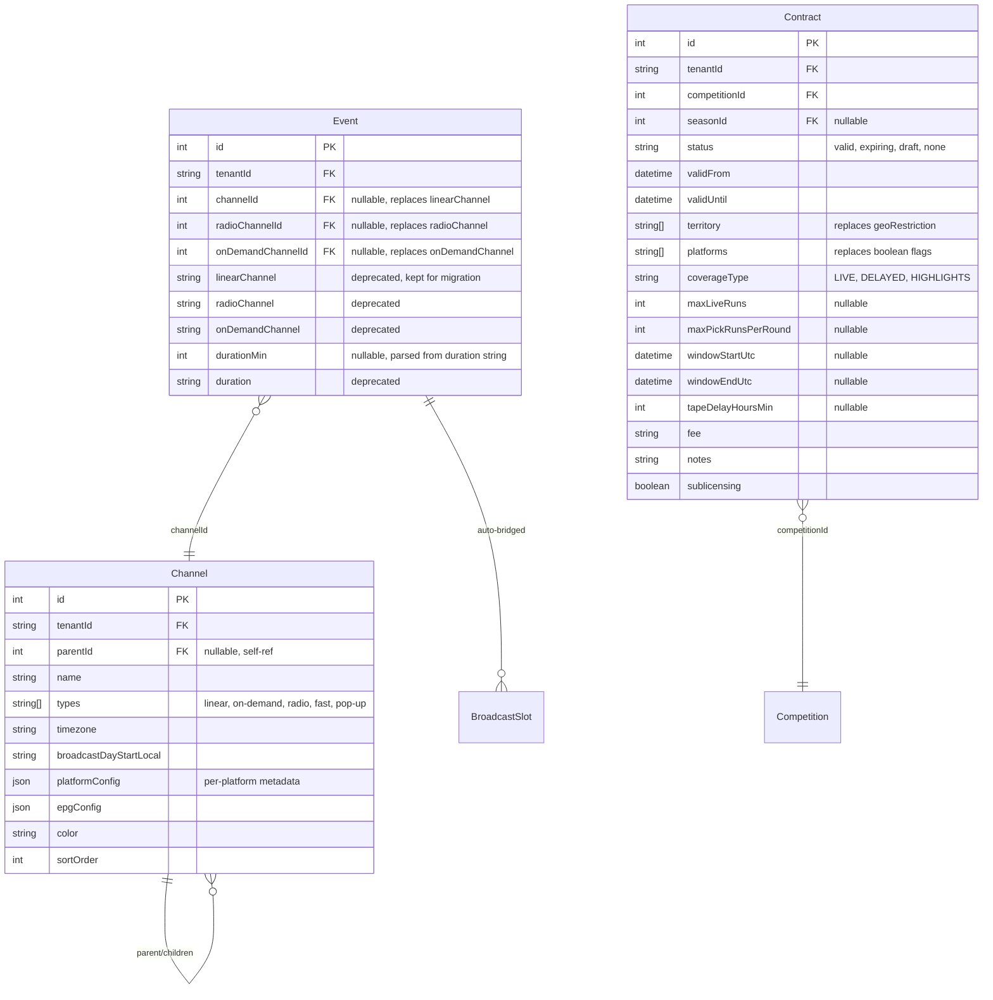

# Unify Planner-Schedule-Cascade Pipeline

## Overview

Eliminate redundant data models, dual conflict checks, fragmented event propagation, and disconnected channel references across the Planner → Schedule → Cascade pipeline. This consolidation creates a single coherent data flow where Events drive BroadcastSlots, channels are first-class entities, rights are unified, and all mutations flow through a transactional outbox.

## Problem Statement

The current system has five core tensions that cause data drift, duplicated logic, and confusing admin experiences:

1. **Channel identity split** — `Event.linearChannel` (free-text string from OrgConfig) vs `Channel` table (FK on BroadcastSlot). Two admin panels, two data stores, no sync.
2. **Rights checking duplication** — `Contract` (4 booleans per medium) vs `RightsPolicy` (run limits, time windows, territory). Two models, two checking systems, neither cross-references the other.
3. **Duration triple** — `Event.duration` (string, never parsed), `BroadcastSlot.expectedDurationMin` (int), cascade `heuristicEstimator` (sport heuristics). Three sources, no normalization.
4. **Event propagation fragmentation** — direct `emit()` + `publishService.dispatch()` + transactional outbox all firing for the same mutation.
5. **No Event→BroadcastSlot bridge** — creating an event in Planner requires manual duplication into a BroadcastSlot in the Schedule view.

## Proposed Solution

### Architecture

```
┌─────────────────────────────────────────────────────────────────┐
│                     UNIFIED DATA FLOW                           │
├─────────────────────────────────────────────────────────────────┤
│                                                                 │
│  Event (Planner)                                                │
│  ├─ channelId FK → Channel table (with hierarchy + types)       │
│  ├─ auto-bridge → BroadcastSlot (synced on time/channel/dur)   │
│  └─ outbox event → workers → Socket.IO + webhooks + cascade    │
│                                                                 │
│  Channel (unified, hierarchical)                                │
│  ├─ parentId self-ref (parent/sub-channel tree)                │
│  ├─ types[] (linear, on-demand, radio, fast, pop-up)           │
│  ├─ platform metadata (YouTube, Netflix, own streamer)          │
│  └─ single dropdown across all views                           │
│                                                                 │
│  Contract (enriched, replaces both Contract + RightsPolicy)     │
│  ├─ deal-level: competition, status, dates, fee, notes          │
│  ├─ rights: territory[], platforms[], coverageType              │
│  ├─ limits: maxLiveRuns, maxPickRunsPerRound, tapeDelay        │
│  └─ single validation pipeline for Planner + Schedule           │
│                                                                 │
│  Outbox (single propagation path)                               │
│  ├─ event CRUD → socketio-worker (UI updates)                  │
│  ├─ event CRUD → webhook-worker (external delivery)            │
│  ├─ fixture status → cascade-worker → alert-worker             │
│  └─ LISTEN/NOTIFY for instant processing                       │
│                                                                 │
└─────────────────────────────────────────────────────────────────┘
```

### ERD (Changed Models)



## Technical Approach

### Implementation Phases

---

#### Phase 1: Channel Model Upgrade

**Goal**: Upgrade the Channel table to support hierarchy, multi-type, and platform metadata. Build the full tree UI in Admin.

##### Task 1.1: Schema migration — Channel model upgrade

Add fields to existing Channel model:

```sql
-- add_channel_hierarchy.sql
ALTER TABLE "Channel" ADD COLUMN "parentId" INT REFERENCES "Channel"(id) ON DELETE SET NULL;
ALTER TABLE "Channel" ADD COLUMN "types" TEXT[] DEFAULT ARRAY['linear'];
ALTER TABLE "Channel" ADD COLUMN "platformConfig" JSONB DEFAULT '{}';
ALTER TABLE "Channel" ADD COLUMN "sortOrder" INT DEFAULT 0;
CREATE INDEX idx_channel_parent ON "Channel"("parentId");
```

Update Prisma schema:

```prisma
model Channel {
  id                     Int       @id @default(autoincrement())
  tenantId               String    @db.Uuid
  parentId               Int?
  name                   String
  types                  String[]  @default(["linear"])
  timezone               String    @default("Europe/Brussels")
  broadcastDayStartLocal String    @default("06:00")
  platformConfig         Json      @default("{}")
  epgConfig              Json      @default("{}")
  color                  String    @default("#3B82F6")
  sortOrder              Int       @default(0)
  createdAt              DateTime  @default(now())
  updatedAt              DateTime  @updatedAt

  tenant        Tenant          @relation(fields: [tenantId], references: [id])
  parent        Channel?        @relation("ChannelTree", fields: [parentId], references: [id])
  children      Channel[]       @relation("ChannelTree")
  // existing relations...
  broadcastSlots BroadcastSlot[]
  scheduleDrafts ScheduleDraft[]
  scheduleVersions ScheduleVersion[]

  @@unique([tenantId, name])
}
```

**Files**: `backend/prisma/schema.prisma`, new migration SQL

##### Task 1.2: Backend — Channel routes upgrade

- Update GET `/channels` to return tree structure (include children, parent)
- Add GET `/channels/tree` endpoint returning nested hierarchy
- Update POST/PUT to accept `parentId`, `types[]`, `platformConfig`, `sortOrder`
- Add `type` query filter (e.g., `GET /channels?type=linear`)

**Files**: `backend/src/routes/channels.ts`

##### Task 1.3: Frontend — Channel types and service

- Add `parentId`, `types`, `platformConfig`, `sortOrder` to Channel interface
- Add `listTree()`, `listByType(type)` to channels service

**Files**: `src/data/types.ts`, `src/services/channels.ts`

##### Task 1.4: Frontend — ChannelsPanel tree UI

Replace the flat table in ChannelsPanel with a tree view:
- Collapsible parent/child rows with indent
- Drag-to-reorder (sortOrder)
- Inline create: name, types (multi-select chips), timezone, color, platformConfig
- "Add Sub-channel" button on parent rows
- Platform metadata editor (accordion per sub-channel)

**Files**: `src/components/admin/ChannelsPanel.tsx`

##### Task 1.5: Frontend — Channel dropdown component

Create a shared `ChannelSelect` component that:
- Fetches from Channel table (not OrgConfig)
- Filters by type (e.g., `type="linear"` shows only channels with `types` containing `"linear"`)
- Renders parent/child hierarchy with indent in dropdown
- Supports single-select (for event forms) with the option of multi-select later
- Used across DynamicEventForm, EventDetailCard, BulkActionBar, ScheduleGrid

**Files**: new `src/components/ui/ChannelSelect.tsx`

---

#### Phase 2: Event → Channel FK Migration

**Goal**: Replace `Event.linearChannel` (string) with `Event.channelId` (FK). Migrate existing data. Switch all UI to ChannelSelect.

##### Task 2.1: Schema migration — Event channel FKs

```sql
-- add_event_channel_fks.sql
ALTER TABLE "Event" ADD COLUMN "channelId" INT REFERENCES "Channel"(id) ON DELETE SET NULL;
ALTER TABLE "Event" ADD COLUMN "radioChannelId" INT REFERENCES "Channel"(id) ON DELETE SET NULL;
ALTER TABLE "Event" ADD COLUMN "onDemandChannelId" INT REFERENCES "Channel"(id) ON DELETE SET NULL;
ALTER TABLE "Event" ADD COLUMN "durationMin" INT;
CREATE INDEX idx_event_channel ON "Event"("channelId");
```

**Files**: `backend/prisma/schema.prisma`, new migration SQL

##### Task 2.2: Data migration script — Channel name matching

Write a migration script that:
1. For each tenant, ensure all OrgConfig channel names exist in the Channel table (auto-create if missing, with `types: ['linear']`)
2. Same for `radioChannels` (types: `['radio']`) and `onDemandChannels` (types: `['on-demand']`)
3. Update `Event.channelId` from `Event.linearChannel` via case-insensitive name match within same tenant
4. Same for `radioChannelId` from `radioChannel`, `onDemandChannelId` from `onDemandChannel`
5. Parse `Event.duration` into `Event.durationMin` (handle `"90 min"`, `"1h30"`, `"01:30:00"`, `"90"` as integer minutes, null on failure)
6. **Dry-run mode**: log what would change without changing it
7. Report: matched count, unmatched (with event IDs), parse-failed durations

**Files**: new `backend/src/scripts/migrateChannelRefs.ts`

##### Task 2.3: Backend — Event routes accept channelId

- Accept `channelId`, `radioChannelId`, `onDemandChannelId` in event create/update
- Continue accepting `linearChannel` string for backwards compat (resolve to channelId on save)
- Event GET responses include `channel: { id, name, color, types }` relation
- Update event filtering: `channel` query param accepts channelId (int) or name (string)

**Files**: `backend/src/routes/events.ts`

##### Task 2.4: Frontend — Switch dropdowns to ChannelSelect

- DynamicEventForm: replace `orgConfig.channels` dropdown with `<ChannelSelect type="linear" />`
- DynamicEventForm: replace on-demand and radio dropdowns with `<ChannelSelect type="on-demand" />` and `<ChannelSelect type="radio" />`
- EventDetailCard: replace channel popover with ChannelSelect
- BulkActionBar: replace channel assign with ChannelSelect
- PlannerView: replace channel filter chips with Channel-table-sourced chips
- PlannerView: replace `getChannelColor(linearChannel)` with `event.channel?.color`

**Files**: `src/components/forms/DynamicEventForm.tsx`, `src/components/sports/EventDetailCard.tsx`, `src/components/planner/BulkActionBar.tsx`, `src/pages/PlannerView.tsx`

##### Task 2.5: Frontend — Remove OrgConfig channels section

- Remove Linear Channels, On-demand Platforms, Radio Channels tabs from OrgConfigPanel
- Add "Manage Channels" link pointing to the ChannelsPanel in Admin sidebar
- Keep OrgConfig for non-channel config (Phases, Categories, Venues, Freeze Window)

**Files**: `src/components/admin/OrgConfigPanel.tsx`

##### Task 2.6: Published feed backwards compat

- `/publish/events` continues returning `linearChannel: channel.name` (resolved from FK)
- Webhook payloads continue including `linearChannel` string (resolved from FK)
- No breaking change for external consumers

**Files**: `backend/src/routes/publish.ts`, `backend/src/services/publishService.ts`

---

#### Phase 3: Event → BroadcastSlot Auto-Bridge

**Goal**: When an Event has a channelId + time, auto-create/sync a linked BroadcastSlot.

##### Task 3.1: Backend — Auto-bridge service

Create `backend/src/services/eventSlotBridge.ts`:

```typescript
// Trigger fields: channelId, startDateBE, startTimeBE, durationMin, schedulingMode, status
export async function syncEventToSlot(event: Event, tx?: PrismaClient): Promise<BroadcastSlot | null>
```

Logic:
- If event has no `channelId` or no `startDateBE`+`startTimeBE` → skip (no slot needed)
- Convert `startDateBE` + `startTimeBE` (Belgium local) to `plannedStartUtc` using channel timezone
- Calculate `plannedEndUtc` from `durationMin` or cascade estimator fallback
- Inherit `schedulingMode` from event (FIXED/FLOATING/WINDOW)
- If event already has a linked BroadcastSlot → update it
- If no linked slot exists → create one with `eventId = event.id`
- On event delete → handled by Prisma cascade (already configured)
- On event status `cancelled` → set slot status to `VOIDED`

**Files**: new `backend/src/services/eventSlotBridge.ts`

##### Task 3.2: Backend — Wire auto-bridge into event routes

- POST `/events`: after create, call `syncEventToSlot(event, tx)` inside the transaction
- PUT `/events/:id`: after update, call `syncEventToSlot(event, tx)` if trigger fields changed
- POST `/events/batch`: call `syncEventToSlot` per event in the batch transaction
- PATCH `/events/:id/status`: if status → cancelled, void linked slot

**Files**: `backend/src/routes/events.ts`

##### Task 3.3: Backfill migration script

Create a script that creates BroadcastSlots for all existing events that have a channelId and startDateBE+startTimeBE but no linked BroadcastSlot.

**Files**: new `backend/src/scripts/backfillEventSlots.ts`

---

#### Phase 4: Rights Model Unification

**Goal**: Merge Contract (boolean rights) and RightsPolicy (run limits, windows, territory) into a single enriched Contract model. Remove RightsPolicy as a separate table.

##### Task 4.1: Schema migration — Enrich Contract model

Add RightsPolicy fields to the Contract model:

```sql
-- enrich_contract_model.sql
ALTER TABLE "Contract" ADD COLUMN "seasonId" INT REFERENCES "Season"(id) ON DELETE SET NULL;
ALTER TABLE "Contract" ADD COLUMN "territory" TEXT[] DEFAULT ARRAY[]::TEXT[];
ALTER TABLE "Contract" ADD COLUMN "platforms" TEXT[] DEFAULT ARRAY[]::TEXT[];
ALTER TABLE "Contract" ADD COLUMN "coverageType" TEXT DEFAULT 'LIVE';
ALTER TABLE "Contract" ADD COLUMN "maxLiveRuns" INT;
ALTER TABLE "Contract" ADD COLUMN "maxPickRunsPerRound" INT;
ALTER TABLE "Contract" ADD COLUMN "windowStartUtc" TIMESTAMPTZ;
ALTER TABLE "Contract" ADD COLUMN "windowEndUtc" TIMESTAMPTZ;
ALTER TABLE "Contract" ADD COLUMN "tapeDelayHoursMin" INT;
```

Migrate existing data:
- `geoRestriction` string → parse into `territory[]` array
- `linearRights: true` → add `"linear"` to `platforms[]`
- `maxRights: true` → add `"on-demand"` to `platforms[]`
- `radioRights: true` → add `"radio"` to `platforms[]`

Keep `linearRights`, `maxRights`, `radioRights` as deprecated columns during transition.

**Files**: `backend/prisma/schema.prisma`, new migration SQL + data migration script

##### Task 4.2: Backend — Update contracts routes

- Extend Joi schema to accept new fields (territory, platforms, coverageType, etc.)
- GET responses include new fields alongside legacy booleans
- POST/PUT accept both legacy booleans and new fields (legacy auto-populates new fields)

**Files**: `backend/src/routes/contracts.ts`

##### Task 4.3: Frontend — ContractForm upgrade

- Add territory multi-select (text input with tag chips)
- Add platforms multi-select chips (linear, on-demand, radio, fast, pop-up)
- Add coverage type dropdown (LIVE, DELAYED, HIGHLIGHTS)
- Add max live runs, max pick runs, tape delay fields
- Add window start/end datetime pickers
- Keep fee, notes, sublicensing
- Legacy boolean toggles become derived from platforms[] (checked if platform in list)

**Files**: `src/components/forms/ContractForm.tsx`, `src/data/types.ts`

##### Task 4.4: Backend — Unified conflict/rights checking

Create `backend/src/services/rightsChecker.ts`:
- Takes an event draft (or BroadcastSlot) + tenant contracts
- Checks: platform coverage (replaces boolean flags), time windows, run limits, territory
- Returns `ValidationResult[]` (same shape as schedule validation)
- Used by both `conflictService.ts` (planner) and `validation/rights.ts` (schedule)

Update `conflictService.ts`:
- Replace direct Contract boolean checks with `rightsChecker` call
- Keep channel overlap check (now uses channelId FK instead of string)
- Keep missing_tech_plan and resource_conflict checks

Update `validation/rights.ts`:
- Delegate to `rightsChecker` with contracts from the database (no longer needs `context.rightsPolicies` injection)

**Files**: new `backend/src/services/rightsChecker.ts`, `backend/src/services/conflictService.ts`, `backend/src/services/validation/rights.ts`

##### Task 4.5: Migrate RunLedger FK from RightsPolicy to Contract

- RunLedger currently references `rightsPolicyId`. Change to `contractId`.
- Migration: map existing RunLedger records via competitionId match.
- After verification, drop RightsPolicy table.

**Files**: `backend/prisma/schema.prisma`, migration SQL, `backend/src/routes/rights.ts`

##### Task 4.6: Frontend — Remove RightsPoliciesPanel

- Remove `src/components/admin/RightsPoliciesPanel.tsx` (read-only list)
- Rights are now managed via ContractsView (the enriched ContractForm)
- Update AdminView sidebar to remove the Rights Policies link

**Files**: `src/components/admin/RightsPoliciesPanel.tsx` (delete), `src/pages/AdminView.tsx`

---

#### Phase 5: Conflict Service Consolidation

**Goal**: Single conflict checking pipeline used by both Planner and Schedule.

##### Task 5.1: Update conflictService channel overlap to use channelId

- Replace string-based `linearChannel` comparison with `channelId` FK comparison
- Use proper time overlap check (UTC timestamps) instead of 30-min proximity
- If event has no channelId, skip channel overlap check

**Files**: `backend/src/services/conflictService.ts`

##### Task 5.2: Wire schedule validation to use Contract-based rights

- `validation/rights.ts` now loads contracts from DB (via `rightsChecker`)
- Remove the `rightsPolicies: []` stub in `schedules.ts` publish endpoint
- Schedule validation context includes `contracts` instead of `rightsPolicies`

**Files**: `backend/src/services/validation/rights.ts`, `backend/src/routes/schedules.ts`

##### Task 5.3: Remove or implement validation stubs

Evaluate each stub:
- `checkTbdParticipantBlock` — remove (can be added when TBD participant feature ships)
- `checkHandoffChainBroken` — implement (important for cascade correctness)
- `checkKnockoutSlotTooShort` — implement (validates knockout match slot sizing)
- `checkTerritoryBlocked` — implement (now possible with enriched Contract territory[])
- `regulatory.ts` — keep stubs (watershed, accessibility are genuinely deferred)
- `business.ts` — keep stubs (simultaneous coverage, prime scheduling deferred)

**Files**: `backend/src/services/validation/structural.ts`, `backend/src/services/validation/duration.ts`, `backend/src/services/validation/rights.ts`

---

#### Phase 6: Full Outbox Migration

**Goal**: All event mutations propagate through the transactional outbox. Remove direct `emit()` and `publishService.dispatch()`.

##### Task 6.1: Create socketio-worker

New worker that reads from a `socketio` BullMQ queue and calls `emit()`:

```typescript
// backend/src/workers/socketWorker.ts
createWorker('socketio', async (job) => {
  const { eventType, payload, room } = job.data
  emit(eventType, payload, room)
  return { emitted: true }
}, { concurrency: 5 })
```

**Files**: new `backend/src/workers/socketWorker.ts`, `backend/src/services/queue.ts` (add `socketioQueue`)

##### Task 6.2: Create webhook-worker

New worker that replaces `publishService.dispatch()`:
- Finds matching WebhookEndpoint records
- Creates WebhookDelivery records
- Attempts HTTP delivery with retry (BullMQ native retries replace setTimeout chain)

**Files**: new `backend/src/workers/webhookWorker.ts`, `backend/src/services/queue.ts` (add `webhookQueue`)

##### Task 6.3: Update outbox event routing

Add new routes to `EVENT_ROUTING`:

```typescript
const EVENT_ROUTING: Record<string, string[]> = {
  'event.created': ['socketio', 'webhook'],
  'event.updated': ['socketio', 'webhook'],
  'event.deleted': ['socketio', 'webhook'],
  'event.status_changed': ['socketio', 'webhook', 'cascade', 'standings', 'bracket'],
  'fixture.status_changed': ['cascade', 'standings', 'bracket'],
  'fixture.completed': ['standings', 'bracket'],
  'match.score_updated': ['cascade'],
  'cascade.recomputed': ['alerts'],
  'schedule.published': ['webhook'],
  'schedule.emergency_published': ['webhook'],
  'channel_switch.confirmed': ['webhook'],
  'slot.created': ['socketio'],
  'slot.updated': ['socketio'],
  'slot.status_changed': ['socketio', 'cascade'],
  'techPlan.created': ['socketio'],
  'techPlan.updated': ['socketio'],
  'techPlan.deleted': ['socketio'],
}
```

**Files**: `backend/src/workers/outboxConsumer.ts`

##### Task 6.4: Remove direct emit() and publishService.dispatch() from routes

- Event routes: remove `emit()` calls and `publishService.dispatch()` — outbox handles both
- TechPlan routes: remove `emit()` — outbox handles it
- BroadcastSlot routes: add outbox writes for PUT (currently missing) and DELETE
- Import routes: switch to outbox for event notifications

**Files**: `backend/src/routes/events.ts`, `backend/src/routes/techPlans.ts`, `backend/src/routes/broadcastSlots.ts`

##### Task 6.5: Deprecate publishService

- Keep `publishService.ts` temporarily for `checkExpiringContracts()` (cron) and `resumeFailedDeliveries()` (startup)
- Remove `dispatch()` method
- Eventually move cron to a scheduled BullMQ job

**Files**: `backend/src/services/publishService.ts`

##### Task 6.6: Outbox LISTEN/NOTIFY for faster processing

Add a PostgreSQL trigger that fires NOTIFY on OutboxEvent INSERT:

```sql
CREATE OR REPLACE FUNCTION notify_outbox_event() RETURNS trigger AS $$
BEGIN
  PERFORM pg_notify('outbox_events', NEW.id::text);
  RETURN NEW;
END;
$$ LANGUAGE plpgsql;

CREATE TRIGGER outbox_event_notify
  AFTER INSERT ON "OutboxEvent"
  FOR EACH ROW EXECUTE FUNCTION notify_outbox_event();
```

Update outbox consumer to use `pg.Client.on('notification')` as primary, `setInterval` as fallback.

**Files**: migration SQL, `backend/src/workers/outboxConsumer.ts`

---

#### Phase 7: Cascade Engine Fixes

**Goal**: Fix bugs and optimize the cascade engine.

##### Task 7.1: Fix completed event time source

Replace `new Date(event.startDateBE)` with BroadcastSlot `actualStartUtc` for completed events:

```typescript
if (status === 'completed') {
  const slot = await prisma.broadcastSlot.findFirst({
    where: { eventId: event.id, tenantId },
    select: { actualStartUtc: true, actualEndUtc: true }
  })
  const startTime = slot?.actualStartUtc || new Date(event.startDateBE)
  // ...
}
```

**Files**: `backend/src/services/cascade/engine.ts`

##### Task 7.2: Batch cascade DB writes

Wrap all upserts + updateMany in a single `prisma.$transaction()`:

```typescript
await prisma.$transaction(async (tx) => {
  for (const est of results) {
    await tx.cascadeEstimate.upsert({ ... })
    await tx.broadcastSlot.updateMany({ ... })
  }
})
```

**Files**: `backend/src/services/cascade/engine.ts`

##### Task 7.3: Feed Event.durationMin into estimator

Update `heuristicEstimator` to check `event.durationMin` as override:

```typescript
shortDuration(event: CascadeEvent): number {
  if (event.durationMin) return event.durationMin * 0.9 // 10% under
  // ... existing sport heuristics
}
longDuration(event: CascadeEvent): number {
  if (event.durationMin) return event.durationMin * 1.2 // 20% over
  // ... existing sport heuristics
}
```

**Files**: `backend/src/services/cascade/estimator.ts`

##### Task 7.4: Scope alert worker to affected courts

Instead of fetching ALL tenant slots, scope to the courts/channels affected by the triggering event:

```typescript
// alertWorker receives { tenantId, courtId?, channelId? } from cascade.recomputed
const where: any = { tenantId, status: { in: ['LIVE', 'PLANNED'] } }
if (courtId) where.sportMetadata = { path: ['court_id'], equals: courtId }
if (channelId) where.channelId = channelId
```

**Files**: `backend/src/workers/alertWorker.ts`

---

#### Phase 8: Duration Normalization

**Goal**: Parse `Event.duration` string into `Event.durationMin` integer. Feed into BroadcastSlot and cascade.

##### Task 8.1: Duration parser utility

```typescript
// backend/src/utils/parseDuration.ts
export function parseDurationToMinutes(raw: string | null | undefined): number | null
// Handles: "90", "90 min", "1h30", "01:30:00", "1h 30m", "2h"
// Returns null on failure
```

**Files**: new `backend/src/utils/parseDuration.ts`

##### Task 8.2: Wire duration parsing into event routes

- On POST/PUT, if `duration` is set but `durationMin` is not provided, auto-parse
- `durationMin` takes precedence over `duration` string if both provided
- Auto-bridge uses `durationMin` for `BroadcastSlot.expectedDurationMin`

**Files**: `backend/src/routes/events.ts`, `backend/src/services/eventSlotBridge.ts`

---

#### Phase 9: Cleanup

##### Task 9.1: Remove deprecated fields after migration verification

Once all data is migrated and verified:
- Mark `Event.linearChannel`, `Event.radioChannel`, `Event.onDemandChannel`, `Event.duration` as `@deprecated` in schema comments
- Mark `Contract.linearRights`, `Contract.maxRights`, `Contract.radioRights`, `Contract.geoRestriction` as `@deprecated`
- Drop RightsPolicy table after RunLedger FK migration is verified
- Remove OrgConfig channels arrays (keep Phases, Categories, Venues, Freeze Window)

##### Task 9.2: Remove publishService.dispatch()

- Delete the `dispatch()` method from publishService.ts
- Move `checkExpiringContracts()` to a scheduled BullMQ job
- Move `resumeFailedDeliveries()` to outbox consumer startup recovery

**Files**: `backend/src/services/publishService.ts`

---

## Acceptance Criteria

### Functional Requirements

- [x] Channels are managed in a single tree UI (Admin → Channels) with parent/child support
- [x] All channel dropdowns across the app (Planner, Sports, Schedule) use ChannelSelect from Channel table
- [x] Creating an Event with a channel + time auto-creates a linked BroadcastSlot
- [x] Updating Event time/channel/duration syncs the linked BroadcastSlot
- [x] Contracts include territory, platforms, run limits, time windows (enriched model)
- [x] Single rights validation pipeline used by both Planner conflict check and Schedule validation
- [x] All event mutations flow through transactional outbox (no direct Socket.IO emit in routes)
- [x] Cascade engine uses BroadcastSlot.actualStartUtc for completed events
- [x] External API (published feeds, webhooks) continues returning channel names as strings (backwards compat)
- [x] Existing events migrated: linearChannel → channelId, duration → durationMin

### Non-Functional Requirements

- [x] Outbox processing latency < 2s (LISTEN/NOTIFY)
- [x] Cascade batch writes in single transaction
- [x] Alert worker scoped to affected courts (not entire tenant)
- [x] All migrations have dry-run mode and rollback scripts

### Quality Gates

- [x] `npx tsc --noEmit` passes (frontend + backend)
- [ ] Migration scripts run successfully on test data with dry-run verification
- [x] No breaking changes to `/publish/events` or webhook payload shapes

## Dependencies & Prerequisites

- Channel table already exists with CRUD routes (Phase 7-8 of broadcast middleware)
- RightsPolicy table exists with CRUD routes (Phase 5 of broadcast middleware)
- OutboxEvent table and BullMQ infrastructure exist (Phase 6 of broadcast middleware)
- Socket.IO namespaces configured (Phase 7 of broadcast middleware)

## Risk Analysis & Mitigation

| Risk | Impact | Mitigation |
|------|--------|------------|
| Channel name matching fails for some events | Events lose channel reference | Dry-run mode, manual review of unmatched events, keep `linearChannel` as fallback |
| Outbox latency degrades planner UX | Users see delayed updates | Creating user still gets immediate response from HTTP; LISTEN/NOTIFY reduces cross-user delay |
| Contract migration loses rights data | Events scheduled without rights | Keep legacy boolean columns during transition, validate migration output |
| Auto-bridge creates unexpected BroadcastSlots | Schedule view cluttered | Only create slots for events with channelId AND time; skip draft events without channel |

## Future Considerations

- Channel multi-select (event on multiple channels simultaneously)
- Sub-channel platform-specific delivery configuration (API keys, endpoints, formats)
- Real-time rights run counting during live broadcasts
- Drag-to-schedule in Schedule view creating Events (reverse bridge)

## References & Research

### Internal References

- Brainstorm: `docs/brainstorms/2026-03-09-planner-schedule-cascade-optimization-brainstorm.md`
- Broadcast middleware design: `docs/plans/2026-03-09-broadcast-middleware-design.md`
- Broadcast middleware plan: `docs/plans/2026-03-09-broadcast-middleware.md`

### Key Files

| File | Role |
|------|------|
| `backend/prisma/schema.prisma` | All model definitions |
| `backend/src/routes/events.ts` | Event CRUD (dual emit + outbox) |
| `backend/src/routes/channels.ts` | Channel CRUD |
| `backend/src/routes/contracts.ts` | Contract CRUD |
| `backend/src/routes/broadcastSlots.ts` | BroadcastSlot CRUD |
| `backend/src/routes/schedules.ts` | Draft/publish with validation |
| `backend/src/services/conflictService.ts` | Planner conflict checks |
| `backend/src/services/validation/` | Schedule 5-stage validation |
| `backend/src/services/cascade/engine.ts` | Cascade algorithm |
| `backend/src/services/cascade/estimator.ts` | Duration heuristics |
| `backend/src/services/publishService.ts` | Webhook dispatch (to be replaced) |
| `backend/src/workers/outboxConsumer.ts` | Event routing table |
| `src/components/forms/DynamicEventForm.tsx` | Event form (channel dropdown) |
| `src/components/sports/EventDetailCard.tsx` | Event detail (channel display) |
| `src/components/admin/OrgConfigPanel.tsx` | Legacy channel management |
| `src/components/admin/ChannelsPanel.tsx` | Channel table management |
| `src/components/admin/RightsPoliciesPanel.tsx` | Rights list (to be removed) |
| `src/pages/PlannerView.tsx` | Planner (channel filter, color map) |
